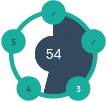

# Atomic

Atomic is a HTML5 progress circular progress bar. The idea is to do this with
minimal use of DOM elements, CSS and JS. This progress bar will be used by the
getting started pages of [Nodejitsu](https://www.nodejitsu.com/) and
[observe.it](https://observe.it).

### How to use

Atomic works by combining CSS sibling power with the animation capacties of the
HTML5 `canvas` element. To use Atomic include the html below and make sure to
add the CSS and JS assets. The example below will generate a progress bar with 5
steps. Removing or adding list items will adjust the progress bar accordingly.



```html
  <section class=atomic>
    <input type=text value=54 size=3 maxlength=3>

    <ol>
      <li><label></label></li>
      <li><label></label></li>
      <li><label></label></li>
      <li><label></label></li>
      <li><label></label></li>
    </ol>

    <canvas></canvas>
  </section>
```

The required CSS and JS assets are small.
 - **atomic.min.js** compressed: 2.4kB minified, 1.1kB gzipped
 - **atomic.min.css** compressed: 8kB minified, 1.1kB gzipped.

### Live Demo

Changing the value of the input will animate the progress inidicator and select
the proper step alongside. A demonstration can be found on the demo page.

### Browser support

Latest chrome, safari, firefox and IE9+

### Tests

TODO
